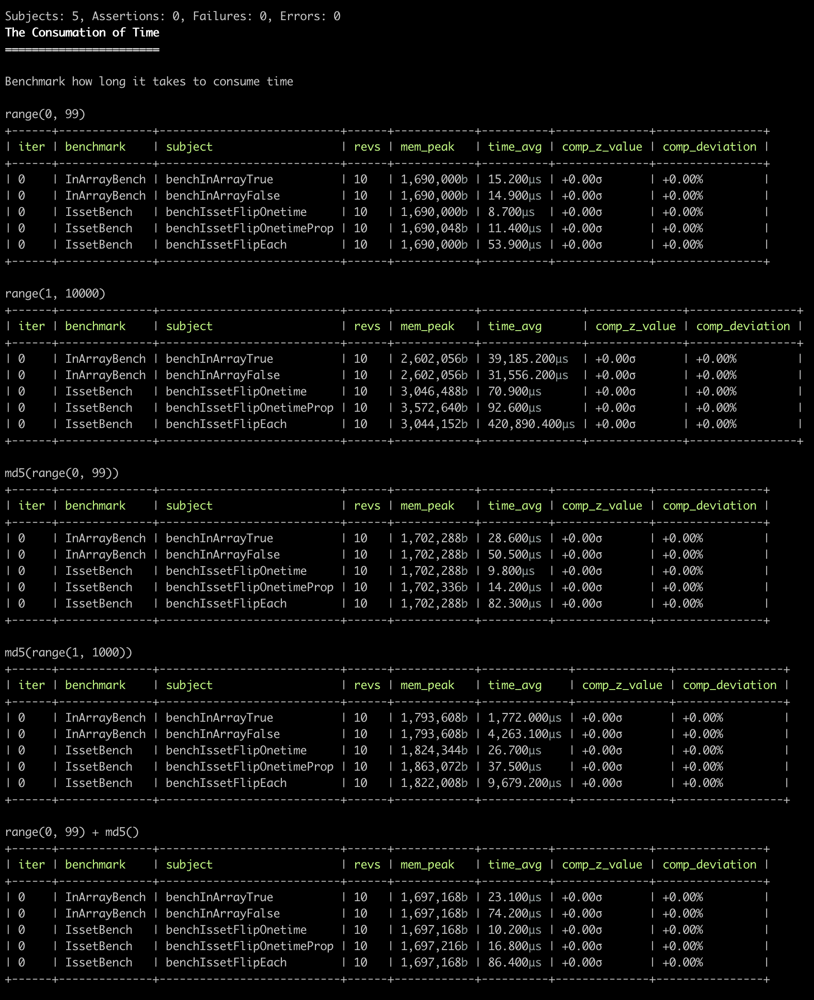

# bench-inarray

この記事は[【PHP】処理速度測定方法　ところでin_arrayってほんとに遅いの？ - Qiita](https://qiita.com/okasir4444/items/2aceed75b9ae6f488d99)にインスパイヤされました。

## 実行方法

```
composer install
php -n ./vendor/bin/phpbench run --report=all tests/Bench/
```

## 結果

実行環境

```
% sw_vers
ProductName:	macOS
ProductVersion:	12.6
BuildVersion:	21G115

% sysctl machdep.cpu
machdep.cpu.cores_per_package: 8
machdep.cpu.core_count: 8
machdep.cpu.logical_per_package: 8
machdep.cpu.thread_count: 8
machdep.cpu.brand_string: Apple M1 Pro

% php -nv
PHP 8.1.12 (cli) (built: Oct 30 2022 12:39:49) (NTS)
Copyright (c) The PHP Group
Zend Engine v4.1.12, Copyright (c) Zend Technologies
```


